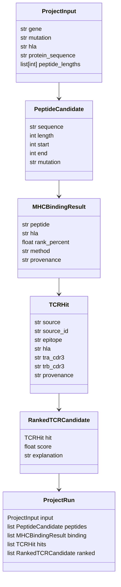
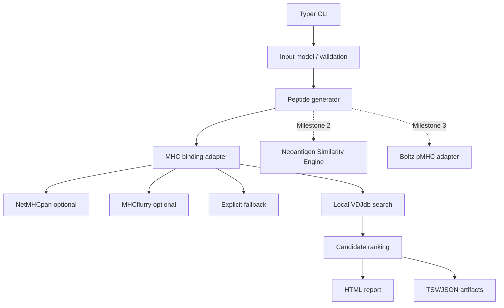

# NeoTCR-Scout Project Spec

## Mission

NeoTCR-Scout is an **evidence-guided workflow for neoantigen-specific TCR discovery and prioritization** for academic research.

It is designed to help researchers answer one practical question quickly:

> Given a mutation and HLA allele, what mutant peptides, binding predictions, and traceable TCR evidence already exist or look similar enough to prioritize follow-up?

## Positioning

NeoTCR-Scout is:

- A **workflow platform** for evidence mining and prioritization.
- A **reproducible research tool** for mutation-to-report analysis.
- A foundation for later structure-aware modules such as Boltz-driven pMHC modeling.

NeoTCR-Scout is **not**:

- A TCR generator.
- A therapeutic design platform.
- A clinical decision system.
- A replacement for NetMHCpan, MHCflurry, VDJdb, IEDB, TCR3D, or other original resources.

## Academic-use and licensing boundary

This repository is intended for academic research workflows. External predictors and databases retain their own licenses and citation requirements.

- NetMHCpan and MHCflurry must only be used by users who have obtained the appropriate rights from the original authors.
- Database snapshots must record source URL, access date, license/terms, checksum, and normalization script.
- Reports must preserve provenance so users can trace every candidate TCR back to a source record or adapter.

## v0.1 minimum viable workflow

### Required input

```text
gene
mutation
hla
```

Canonical demo:

```bash
neotcr-scout run \
  --gene KRAS \
  --mutation G12D \
  --hla HLA-A*11:01
```

### Required output

```text
results/
├── peptides.tsv
├── peptides.tsv
├── mhc_binding.tsv
├── tcr_hits.tsv
├── evidence_score.tsv
├── report.md
└── report.html
```

### v0.1 scope

v0.1 does exactly this:

```text
Mutation + HLA
      ↓
Generate 8-11mer mutant peptides
      ↓
Predict MHC binding or record a licensed-tool fallback/provenance status
      ↓
Search local VDJdb-style evidence
      ↓
Rank and write candidate TCR evidence
      ↓
Generate an HTML report
```

### v0.1 non-goals

Do **not** include these in v0.1:

- AlphaFold.
- Boltz.
- Docking.
- TCR generation.
- Large model training.
- Clinical interpretation.

## Milestones

### Milestone 1: runnable v0.1 evidence report

Target runtime command:

```bash
neotcr-scout run examples/kras_g12d_hla_a1101.yaml --out results/kras_g12d
```

The CLI may also expose direct flags for quick experiments:

```bash
neotcr-scout run --gene KRAS --mutation G12D --hla HLA-A*11:01
```

Outputs:

- `peptides.tsv`
- `mhc_binding.tsv`
- `tcr_hits.tsv`
- `evidence_score.tsv`
- `report.md`
- `report.html`

Success criteria:

- A wet-lab or computational biology user can run the KRAS G12D demo in minutes.
- Every row in the report has traceable provenance.
- The workflow still runs in environments without licensed NetMHCpan/MHCflurry, but clearly marks fallback predictions.

### Milestone 2: Neoantigen Similarity Engine

Goal: identify TCR evidence from related mutations and homologous RAS-family contexts.

Examples:

```text
KRAS G12D
KRAS G12V
KRAS G13D
NRAS G12D
HRAS G12D
```

Scientific question:

> Has any similar mutation already produced a reported TCR or TCR-like evidence?

Minimum outputs:

- `similar_mutations.tsv`
- `similarity_hits.tsv`
- report section explaining why each related mutation was considered.

### Milestone 3: Boltz pMHC structure module

Goal: add structure-aware prioritization after v0.1 evidence mining is stable.

Workflow:

```text
Mutant peptide
      ↓
Boltz pMHC prediction
      ↓
TCR-facing residue annotation
      ↓
Structure-aware report section
```

Minimum outputs:

- `pmhc_structure.pdb` or equivalent structure artifact.
- `tcr_facing_residues.tsv`
- report section listing exposed peptide positions.

## Architecture principles

1. **Small core, replaceable adapters**: keep peptide generation, binding prediction, database search, scoring, and reporting as independent interfaces.
2. **Evidence first**: every output must preserve source, method, version/status, and confidence/rank.
3. **No hidden clinical claims**: reports must state that outputs are research hypotheses, not therapy recommendations.
4. **Licensed tools are optional adapters**: absence of external tools should not break demo execution, but reports must disclose fallback usage.
5. **Structure later**: Boltz and pMHC modules should integrate after v0.1 report artifacts are stable.

## Core interfaces

```python
def generate_mutant_peptides(gene: str, mutation: str, wt_sequence: str, lengths: list[int]) -> list[PeptideCandidate]:
    """Return mutation-containing peptides with coordinates and provenance."""


def predict_mhc_binding(peptides: list[PeptideCandidate], hla: str) -> list[MHCBindingResult]:
    """Return binding ranks from NetMHCpan/MHCflurry adapters or explicit fallback results."""


def search_tcr_database(peptides: list[PeptideCandidate], hla: str) -> list[TCRHit]:
    """Return local VDJdb/IEDB/TCR3D-style hits with source-row provenance."""


def rank_tcr_candidates(hits: list[TCRHit]) -> list[RankedTCRCandidate]:
    """Return deterministic ranked candidates with explainable score components."""


def generate_html_report(project: ProjectRun) -> Path:
    """Write a human-readable report linked to TSV/JSON artifacts."""
```

## Data model sketch



## Dependency graph



## Testing strategy

High-quality tests are part of the architecture, not an afterthought.

### Required v0.1 tests

- KRAS G12D peptide generation includes expected 8-11mer windows.
- HLA-A*11:01 binding adapter returns deterministic records in no-tool environments.
- Fake NetMHCpan and fake MHCflurry executables can be discovered and parsed.
- Local VDJdb search returns traceable hits for the KRAS demo.
- `report.html` contains input, peptide, binding, candidate TCR, and provenance sections.

### Golden demo

The canonical demo must remain:

```text
KRAS G12D + HLA-A*11:01
```

This demo is the release gate for v0.1.

## One-week execution plan

- **Day 1**: project spec, boundaries, and interface review.
- **Day 2**: repo scaffold and CLI shell.
- **Day 3**: mutation-to-peptide generation.
- **Day 4**: local VDJdb search.
- **Day 5**: HTML report and provenance artifacts.
- **Day 6**: KRAS demo hardening.
- **Day 7**: first GitHub release.


## v0.1 implementation requirements

- Use Pydantic-style schema validation for input models, with clear errors for mutation and HLA formats.
- Use Typer for the installed CLI when available; a stdlib fallback is acceptable for minimal test environments.
- Use Pandas/Jinja2 for tables and HTML rendering when available; deterministic stdlib fallbacks must keep tests runnable.
- Produce both Markdown and HTML reports.
- Include experimental planning suggestions for top mutant peptides.
